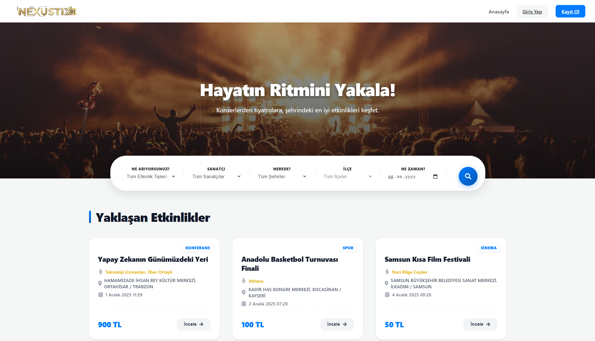
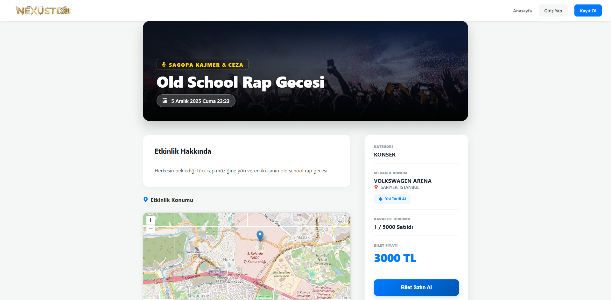
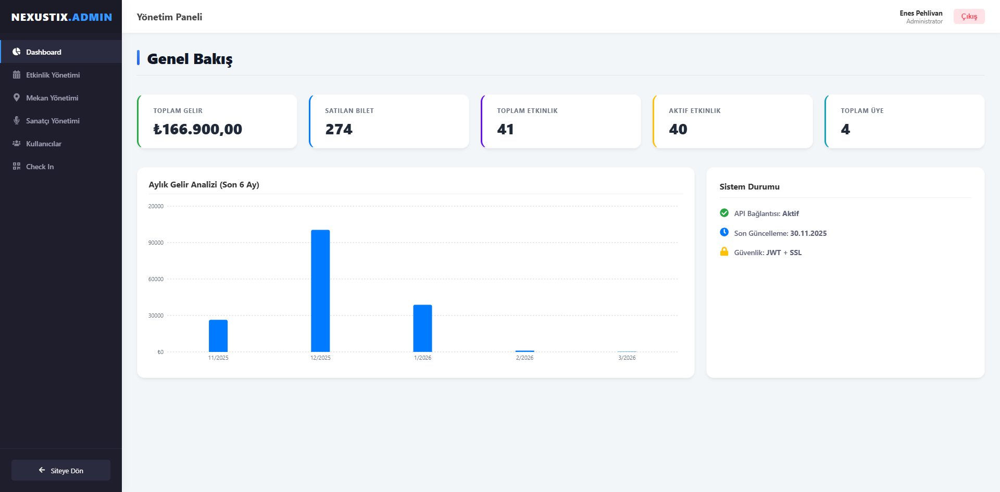
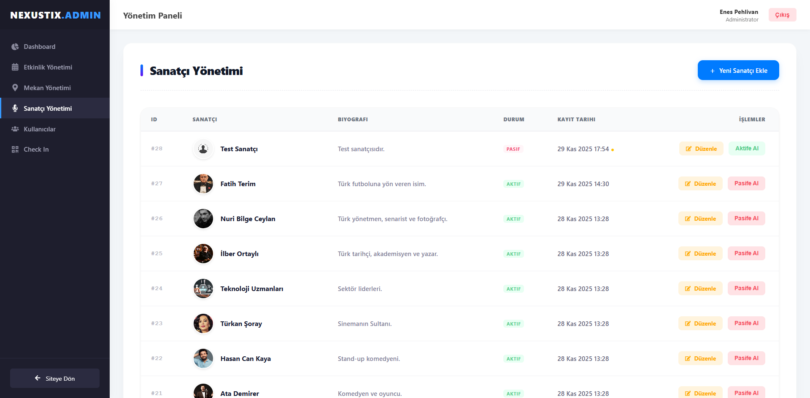
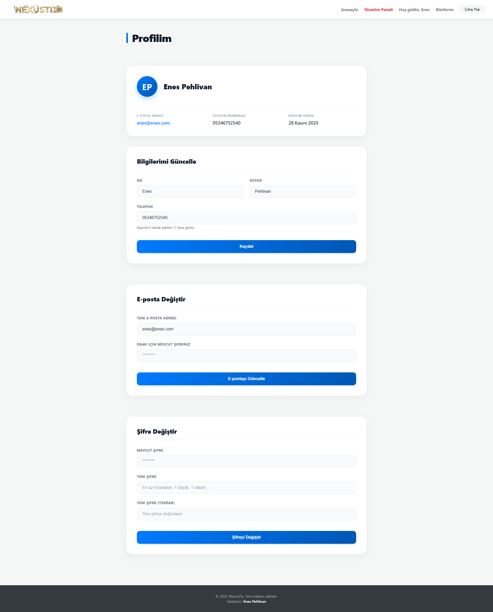
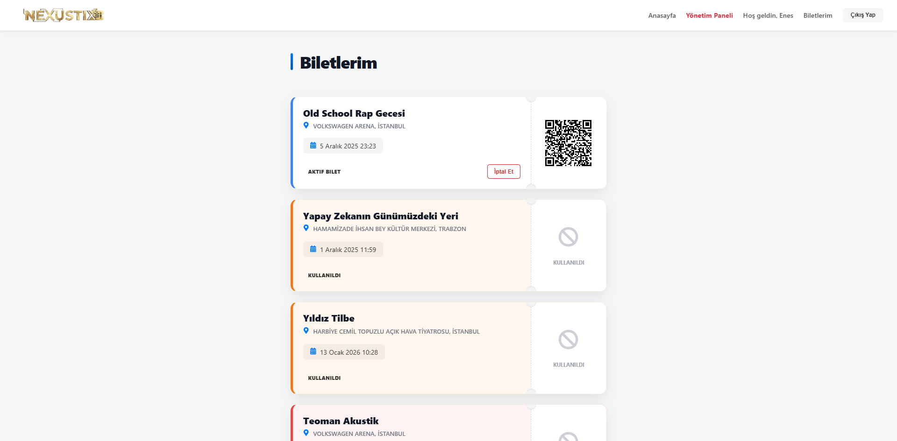

# 🎫 NexusTix - Frontend Client


**NexusTix Frontend**, kullanıcıların etkinlikleri keşfedip bilet alabildiği, yöneticilerin ise tüm sistemi gelişmiş bir panel üzerinden yönetebildiği modern bir Tek Sayfa Uygulamasıdır (SPA). Proje, **React 19** ve **TypeScript** kullanılarak, modüler ve sürdürülebilir bir mimari ile geliştirilmiştir.

> **Backend Reposu:** [NexusTix Backend](https://github.com/Enesphlvn/NexusTixBackend)

---

## 📸 Ekran Görüntüleri

| 🏠 Anasayfa & Akıllı Arama | 🗺️ Etkinlik Detay & Harita |
|----------------------------|-----------------------------|
|  |  |

| 📊 Admin Dashboard | 🎤 Sanatçı Yönetimi |
|--------------------|------------------------|
|  |  |

| 👤 Profil | 🎫 Biletlerim |
|--------------------|------------------------|
|  |  |

---

## 🏗️ Mimari ve Tasarım

Projede kodun okunabilirliğini, test edilebilirliğini ve bakımını kolaylaştırmak için **"Hook-Component-Page"** tasarım deseni uygulanmıştır.

* **📂 Pages (Sayfalar):** Sadece birleştirici (Container) görevi görürler. HTML veya iş mantığı içermezler. Hook'u çağırır ve veriyi Component'e iletirler.
* **📂 Components (Bileşenler):** "Dumb" (Sunum) bileşenlerdir. Verinin kaynağını bilmezler, sadece `props` ile gelen veriyi ekrana çizerler. **CSS Modules** ile izole stillendirme yapılmıştır.
* **📂 Hooks (Kancalar):** API isteklerini yönetir, loading/error durumlarını kontrol eder ve işlenmiş veriyi sayfaya sunar.
* **📂 Context & Redux:** Global veri akışı ve kimlik doğrulama (Auth) yönetimi için hibrit bir yapı kullanılmıştır.

---

## 🛠️ Teknoloji Yığını (Tech Stack)

#### 🔹 **Çekirdek (Core):** React 19 & TypeScript, Vite 7

#### 🔹 **Durum Yönetimi (State Management):** Redux Toolkit, Context API

#### 🔹 **Yönlendirme & Ağ (Routing & Network):** React Router DOM, Axios

#### 🔹 UI & UX Kütüphaneleri:
* **📊 Recharts:** Admin Dashboard'unda gelir ve satış verilerini analiz etmek için interaktif grafikler.
* **🗺️ React-Leaflet:** Etkinlik detay sayfalarında mekanın konumunu harita üzerinde göstermek için.
* **🔔 React-Toastify:** Kullanıcıya anlık geri bildirimler vermek için.
* **⚠️ SweetAlert2:** Kritik işlemlerde (Silme, Pasife Alma) modern onay pencereleri için.
* **📱 QRCode.react:** Satın alınan biletler için dinamik QR kod üretimi.
* **🎨 React-Icons:** Proje genelinde tutarlı vektörel ikon kullanımı.

---

## 🚀 Özellikler

### 👤 Kullanıcı Paneli
* **Filtreleme:** Kategori, Sanatçı, Şehir, İlçe ve Tarihe göre detaylı filtreleme.
* **Detaylı Görüntüleme:** Etkinlik detayı, harita, stok uyarısı ve bilet satın alma.
* **Biletlerim:** QR kod görüntüleme ve bilet iptali.
* **Profil:** Profil bilgileri, şifre ve email güncelleme.

### 🛡️ Admin Paneli
* **Dashboard:** Aylık gelir grafiği ve sistem özet kartları.
* **CRUD Yönetimi:** Etkinlik, Mekan, Sanatçı ve Kullanıcılar için tam kapsamlı yönetim(Ekleme, Güncelleme, Pasife Alma).
* **Check-In Terminali:** Kapı girişinde QR kod okutarak bilet doğrulama.

---

## ⚙️ Kurulum ve Çalıştırma

### Gereksinimler
* Node.js (v18 veya üzeri)

### Adımlar

1.  **Repoyu Klonlayın:**
    ```bash
    git clone [https://github.com/Enesphlvn/NexusTix.Frontend](https://github.com/Enesphlvn/NexusTix.Frontend)
    cd NexusTix.Frontend
    ```

2.  **Bağımlılıkları Yükleyin:**
    ```bash
    npm install
    ```

3.  **Uygulamayı Başlatın:**
    ```bash
    npm run dev
    ```
    Tarayıcıda `http://localhost:5173` adresine giderek projeyi görüntüleyebilirsiniz.

---

## 📁 Klasör Yapısı

```text
src/
├── api/          # Axios servisleri (Backend istekleri)
├── assets/       # Proje logosu
├── components/   # UI bileşenleri
├── hooks/        # İş mantığı ve State
├── models/       # TypeScript arayüzleri
├── pages/        # Sayfa bileşenleri
├── router/       # Rota yapılandırması
└── store/        # Auth slice ve Store yapılandırması
```


---

## 📞 İletişim

Geliştirici: **[Enes PEHLİVAN]**
* GitHub: [github.com/Enesphlvn](https://github.com/Enesphlvn)
* LinkedIn: [linkedin.com/in/enespehlivan](https://www.linkedin.com/in/enespehlivan/)
